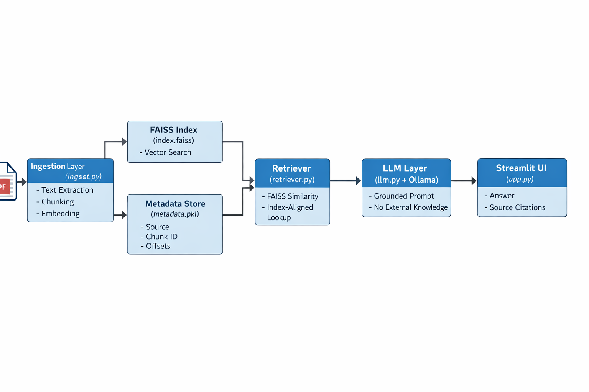

# End-to-End-LocalRAG

# Minimal Local RAG — my-local-rag-v1

> **Current version:** v3.0 — FAISS-based retrieval with source citations  
> This project evolved incrementally from a minimal RAG prototype (v1) to a more realistic, explainable system (v3).

 
A minimal, local Retrieval-Augmented Generation (RAG) system I built to learn how retrieval + local LLMs work together.
This repo implements a small, end-to-end pipeline: document ingestion → chunking → embeddings → vector retrieval → grounded generation with a local Ollama model.

### Quick start -

#### create & activate venv (Windows example)
` python -m venv .venv`

`.venv\Scripts\activate `

#### install deps
`pip install -r requirements.txt`

#### ingest a file (from project root)
`python src/ingest.py path/to/document.pdf`

#### or use the Streamlit app:
`streamlit run src/app.py`

Open the streamlit UI, upload a PDF/TXT, click Ingest Document, then ask questions in the main UI.

### How it works — 

1. Upload a document (PDF or TXT).

2. The document text is extracted and split into overlapping chunks so each chunk contains meaningful context.

3. Each chunk is converted to a fixed-length vector (embedding) with a SentenceTransformer model. These embeddings are saved to disk.

4. At query time, the user’s question is embedded with the same model. Similarity (cosine) is computed between the question vector and stored chunk vectors. Top-k closest chunks are returned.

5. Those chunks are injected (only those chunks) into a clear prompt that instructs the LLM to answer using only the provided context. If the answer is not in the context, the model replies “Not found in the provided document.”

6. The app shows both the concise answer and the retrieved chunks.

7. In v3, embeddings are stored in a FAISS index instead of a brute-force NumPy store, allowing efficient similarity search even as the number of chunks grows.

8. Chunk metadata (document name, chunk ID, character offsets) is stored separately but aligned by index position with the FAISS vectors.

9. At query time, retrieved chunks are displayed along with their source information, making each answer explainable and auditable.

### High-level architecture -

### How I ran tests -

* Created a small sample.txt and verified python ingest.py sample.txt created vector_store.pkl.

* Used a Python shell to import Retriever and confirm retrieve(query) returns semantically relevant chunks.

* Launched streamlit run app.py, ingested a document, asked supported and unsupported questions and validated the grounded response and the “Not found…” refusal.

### v1 → v2 summary -

* v1 — Minimal, working RAG: ingestion, chunking, embeddings, NumPy cosine retrieval, basic prompt. Good for correctness.

* v2 — Focused on retrieval hygiene and grounded prompting:

   * Cleaned chunk generation (strip and drop very short/noisy chunks).

   * Added a configurable MIN_CHUNK_LENGTH.

   * Added safety checks and clamped top_k.

   * Strengthened prompt to explicitly forbid prior knowledge and to refuse if the answer isn’t in context.

Result: fewer hallucinations, more reliable retrieval, clearer demo behavior.

### v3 summary -

* Replaced brute-force cosine similarity with FAISS-based vector search for better scalability.

* Normalized embeddings and used inner-product similarity to approximate cosine similarity efficiently.

* Added chunk-level metadata (source document, chunk ID, offsets) aligned with FAISS indices.

* Updated retrieval to return both text and metadata.

* Rendered source citations in the Streamlit UI to make answers explainable and debuggable.

Result: retrieval is faster, stateless, and each answer can be traced back to its source.

### Known limitations -

* Very small documents can produce duplicate chunks because of overlap and short length (easy to address with deduplication).

* Streamlit session state can retain stale context if the app flow isn’t reset after certain out-of-context queries.

* FAISS is used for vector search, but the system is still single-node and single-document.

* No reranking or citation formatting (v4).

### Why I built this

This project is intentionally framework-light and incremental.  
Each version focuses on a specific engineering concern:

* v1 — correctness
* v2 — grounding and reliability
* v3 — scalability and explainability

The goal is to deeply understand how RAG systems work internally, not just how to use libraries.

