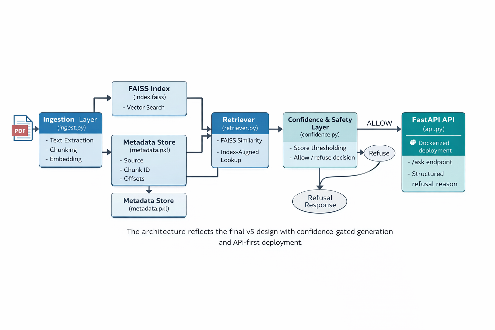

# End-to-End-LocalRAG

# Minimal Local RAG — my-local-rag-v1

> **Current version:** v5.0— Retrieval confidence, safety gating, minimal evaluation, and Dockerized deployment  
> This project evolved incrementally from a minimal RAG prototype (v1) to a production-inspired, safety-aware system (v5).

 
A minimal, local Retrieval-Augmented Generation (RAG) system I built to learn how retrieval + local LLMs work together.
This repo implements a small, end-to-end pipeline: document ingestion → chunking → embeddings → vector retrieval → grounded generation with a local Ollama model.

### Quick start -

#### create & activate venv (Windows example)
` python -m venv .venv`

`.venv\Scripts\activate `

#### install deps
`pip install -r requirements.txt`

#### ingest a file (from project root)
`python src/ingest.py path/to/document.pdf`

### How it works — 

1. Upload a document (PDF or TXT).

2. The document text is extracted and split into overlapping chunks so each chunk contains meaningful context.

3. Each chunk is converted to a fixed-length vector (embedding) with a SentenceTransformer model. These embeddings are saved to disk.

4. At query time, the user’s question is embedded with the same model. Similarity (cosine) is computed between the question vector and stored chunk vectors. Top-k closest chunks are returned.

5. Those chunks are injected (only those chunks) into a clear prompt that instructs the LLM to answer using only the provided context. If the answer is not in the context, the model replies “Not found in the provided document.”

6. The app shows both the concise answer and the retrieved chunks.

7. In v3, embeddings are stored in a FAISS index instead of a brute-force NumPy store, allowing efficient similarity search even as the number of chunks grows.

8. Chunk metadata (document name, chunk ID, character offsets) is stored separately but aligned by index position with the FAISS vectors.

9. At query time, retrieved chunks are displayed along with their source information, making each answer explainable and auditable.

### High-level architecture -

### How I ran tests

- Created a small `sample.txt` file and verified that:
  
  `python ingest.py sample.txt`

  correctly generated the FAISS index and metadata files.

* Used a Python shell to import the retriever and confirm that:

  * retrieve(query) returns semantically relevant chunks

  * similarity scores are exposed in structured retrieval results

* Launched the FastAPI server and tested the system using the interactive API docs:

  
  `uvicorn src.api:app --reload`

* Sent both in-scope and out-of-scope queries via /ask and verified that:

  * high-confidence retrievals produce grounded answers with citations

  * low-confidence or unrelated queries are safely refused with an explicit reason

### Minimal evaluation results

A lightweight evaluation was run to validate the retrieval-confidence gating behavior.

- Total evaluation queries: 17
- Queries included:
  - in-scope questions answerable from the ingested document
  - intentionally out-of-scope questions

**Observed outcomes**
- Correct decisions: 14 / 17
- False allows (unsafe answers): 3
- False refuses: 0

The system favors conservative refusal over unsafe answering.
Observed failure cases are logged and primarily arise from embedding similarity limitations on loosely related technical queries.

### v1 → v2 summary -

* v1 — Minimal, working RAG: ingestion, chunking, embeddings, NumPy cosine retrieval, basic prompt. Good for correctness.

* v2 — Focused on retrieval hygiene and grounded prompting:

   * Cleaned chunk generation (strip and drop very short/noisy chunks).

   * Added a configurable MIN_CHUNK_LENGTH.

   * Added safety checks and clamped top_k.

   * Strengthened prompt to explicitly forbid prior knowledge and to refuse if the answer isn’t in context.

Result: fewer hallucinations, more reliable retrieval, clearer demo behavior.

### v3 summary -

* Replaced brute-force cosine similarity with FAISS-based vector search for better scalability.

* Normalized embeddings and used inner-product similarity to approximate cosine similarity efficiently.

* Added chunk-level metadata (source document, chunk ID, offsets) aligned with FAISS indices.

* Updated retrieval to return both text and metadata.

* Rendered source citations in the Streamlit UI to make answers explainable and debuggable.

Result: retrieval is faster, stateless, and each answer can be traced back to its source.

### v4 → v5 evolution summary

**v4 — Retrieval confidence & safety layer**
- Updated the retriever to return structured results including rank and similarity score.
- Introduced a confidence evaluation layer to decide whether it is safe to answer.
- Added explicit refusal logic for:
  - empty retrievals
  - low-confidence retrievals
- Gated LLM generation so answers are produced only when retrieval quality is sufficient.
- Logged retrieval metrics and confidence decisions for observability and debugging.

Result: the system no longer blindly trusts retrieved context and can safely refuse when confidence is low.

**v5 — Minimal evaluation and deployability**
- Created a small labeled evaluation set containing both answerable and out-of-scope queries.
- Evaluated ALLOW vs REFUSE decisions based on retrieval confidence.
- Tracked false-allow and false-refuse behavior to understand safety trade-offs.
- Containerized the full FastAPI-based RAG system using Docker.

Result: the RAG system is measurable, defensible, and deployable.

### Known limitations -

* Very small documents can produce duplicate chunks because of overlap and short length (easy to address with deduplication).

* Streamlit session state can retain stale context if the app flow isn’t reset after certain out-of-context queries.

* FAISS is used for vector search, but the system is still single-node and single-document.

* No reranking or citation formatting (v4).

* Embedding-based similarity can occasionally surface weakly related chunks for out-of-domain technical questions, leading to measured false allows.

### Why I built this

This project is intentionally framework-light and incremental.  
Each version focuses on a specific engineering concern:

* v1 — correctness  
* v2 — grounding and reliability  
* v3 — scalability and explainability  
* v4 — safety and confidence-aware generation  
* v5 — evaluation and deployability

The goal is to deeply understand how RAG systems work internally, not just how to use libraries.

### Note on Streamlit UI

An earlier prototype included a Streamlit-based UI for document ingestion and querying.
The current version uses a FastAPI backend and Dockerized deployment as the primary interface.

The Streamlit UI is not part of the production workflow and is retained only for reference.
